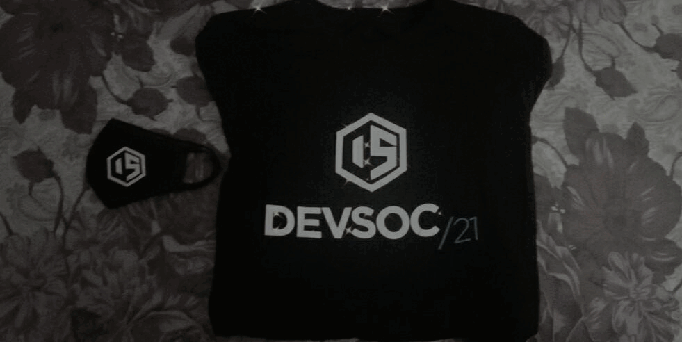

## Hello there, fellow developers! 👋
\

My name is Ayush, and I am a pre-final year undergraduate student from India. I love to learn new technologies and collaborate with people in tech. I am currently working on some opensource projects

 I am learning a lot new things in the tech and my interests incline towards web development and machine learning

> <h3>Connect with me on:</h3>

  
  
  

<!-- <h2 align="center">Download My resume</h2>

    

 -->

## > Experience 
 - [CHAOSS](https://chaoss.community/) - Present
    - CHAOSS is an opensource organization, is one of the Linux foundation projects which is focused on creating
analytics and metrics to help define community health.
    - I am currently maintaining the [badging bot project](https://github.com/badging/badging-bot) which is a part of the DEI badging initiative by CHAOSS.
    - I am also contributing in software project Augur.
    - I love partcipating in technical and non-technical events organized here

 

 - [RRCAT](https://www.rrcat.gov.in/index_eng.html) - September to November 2021
    - RRCAT is a unit of department of Atomic energy, Government of India
    - I worked here on a project as a summer intern
    - Project description: Developement of Software for three electrodes based electron beam position calculation using artificial neural network.
    - My complete certificate and LOR, can be found [here](https://drive.google.com/drive/folders/1I6FldO3LAu-j8NcM8VPc0DgVJnPVRzA3?usp=sharing)

<h2 align="center">My Github stats</h2>

    <!--  -->

   

   

<!-- 

    

  

 -->

<h2 align="center">My Devpost achievments</h2>

  

<h2 align="center">🏆 My achievments</h2>

<h3 align="center">👨‍💻 Hackathons (Listed Latest at the top)</h3>
  <ul align="center">
    <li>Reached Review 2 in devsoc 2021, in top 40 teams</li>
    <li>Winner of Winhacks 2021(sponsored by MLH) in the totally not twitter category </li>
    <li>Winner of echoAR sponsor prize at tartan hacks 2021</li>
  </ul>

 

<h2 align="center"> ⚡ Fun fact </h2>
    
<h3 align="center"> Everyone is a newbie. So don't worry just keep patience and keep hustling</h3>
